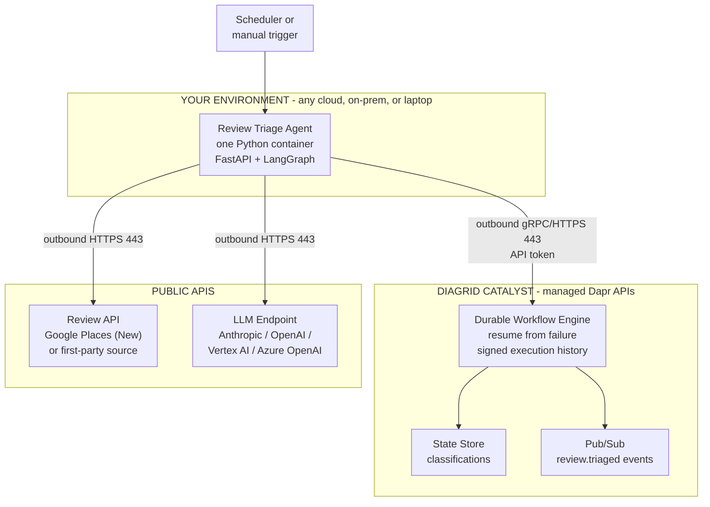
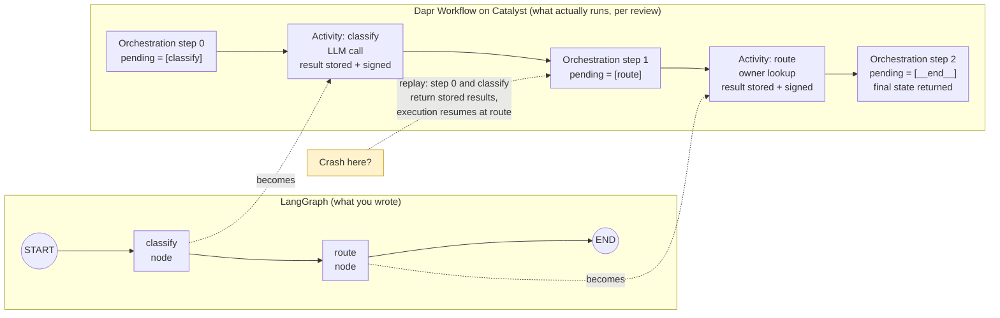
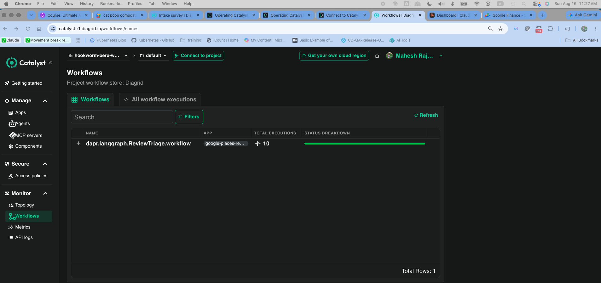
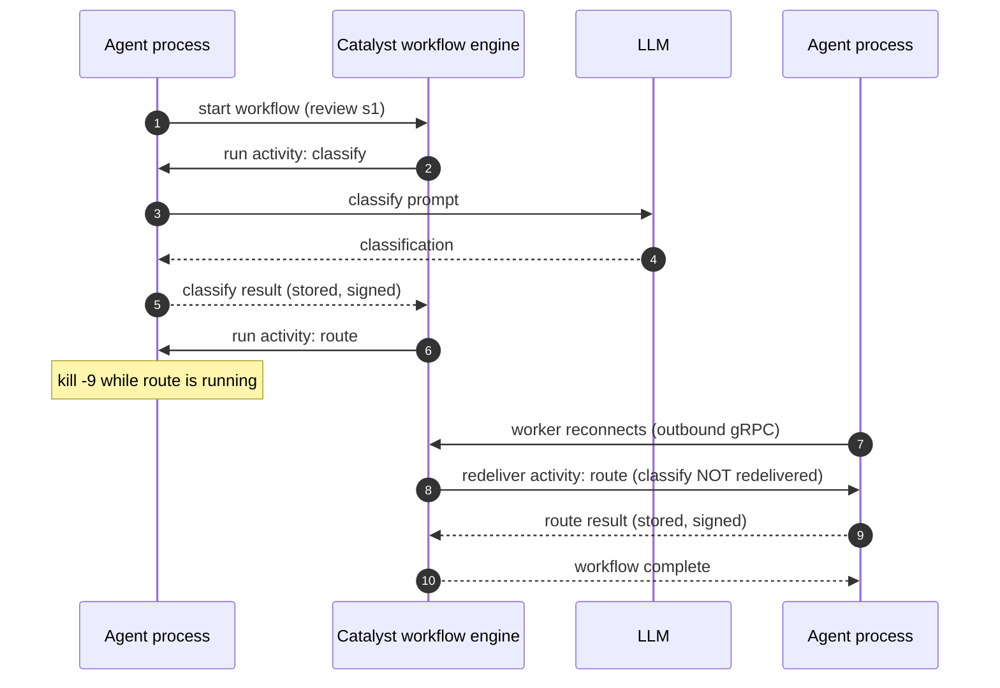
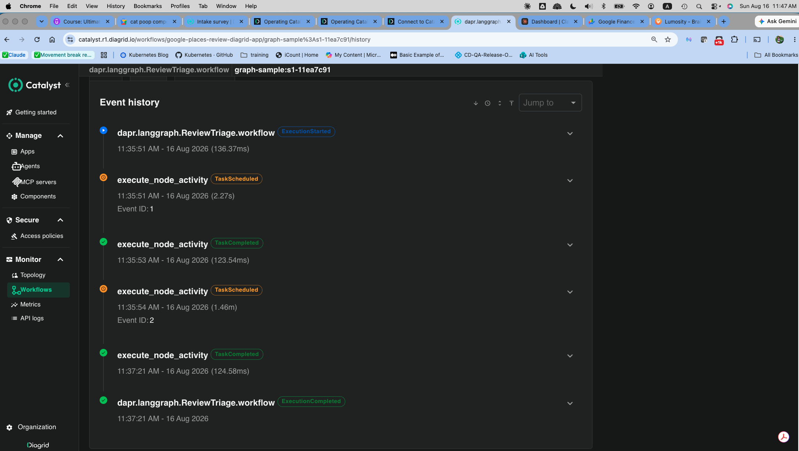

# The Minimum-Approval Enterprise Agent: A Durable Review-Triage Agent on Dapr Catalyst 2.0

> An architect's guide to shipping an AI agent with one container, outbound-only networking, and zero infrastructure tickets. Runs on public Google Places review data; production swaps in your first-party feedback source without touching the agent. Every claim below is verified against source or against a live run on August 16, 2026 (Catalyst free tier, `diagrid` 0.4.3). Companion repo with runnable code, runbook, logs, and the long-form adoption notes: https://github.com/maheshrajannan/dapr-catalyst-friction-less

**What you will see by the end.** A LangGraph agent, unchanged except for one wrapper line, running as Catalyst durable workflows. Then a `kill -9` while a step is executing, a restart, and Catalyst redelivering exactly one activity: the classify step (2.27 seconds, one LLM call) was never re-run, the route step's recorded duration was 1.46 minutes (the outage), and the instance finished COMPLETED with no failure recorded. Screenshots and logs are in the repo.

## The real blocker is not code

Diagrid's quickstarts already teach you to build a durable agent in 15 minutes, including a crash test. Go read their docs for the build.

This post covers what their docs do not: getting an agent **approved and running inside a locked-down enterprise**, and giving readers a demo they can actually run. In a Fortune 500 environment, agent code is the easy part. Every dependency is a firewall request, a security review, and a three-week infrastructure ticket. Redis for state? Ticket. Kafka for events? Ticket plus capacity review. A Kubernetes cluster with a Dapr (Distributed Application Runtime) control plane? A platform-team engagement measured in quarters. Most enterprise agent projects die in that queue.

## The 80/20 rule, applied to approval instead of features

The 20% of agent architecture that gets 80% of the value is a constraint: **every dependency must be an outbound HTTPS call to an allowlisted domain.** No inbound rules. No new stateful infrastructure inside the perimeter. No cluster.

Dapr Catalyst is the managed, serverless version of the Dapr APIs: state, pub/sub, service invocation, bindings, and durable workflows delivered as a cloud service your app reaches over outbound HTTPS or gRPC (port 443) with an API token, no sidecar. Catalyst 2.0 adds durable execution (a crashed agent resumes from the exact failed step) and verifiable execution (cryptographically signed step history; the signing shipped upstream in open-source Dapr 1.18 on June 10, 2026). It is offered as multi-tenant cloud, dedicated, self-hosted, and fully air-gapped.

## The use case: durable review triage

Customer feedback is the one queue every enterprise has and every reader can reach. Public Google reviews are the demo-friendly version: no internal ticketing tool, no VPN, no access request. The agent fetches the latest reviews for a place (Google Places API (New), up to five per place, any billed GCP project), classifies each with an LLM (sentiment, theme, urgency), routes it to an owning team, persists the classification, and publishes a `review.triaged` event. Each review runs as a Catalyst durable workflow.

**Swap the input, keep the agent.** In production, replace the Places fetch with your first-party feedback source: CRM exports, app-store reviews, NPS comments, dealer surveys. The durable agent, the checkpoints, and the firewall story are unchanged. The demo proves the architecture on public data; production only re-points the input.

## Architecture



Recall hook: **A-C-L = "Agent Calls out, Latches on"**. One agent container, Catalyst for durability and messaging, public APIs for input and inference. Every arrow crosses the firewall in one direction: outbound.

## The one-sentence security review

When InfoSec asks what the application needs, the complete answer is:

> "One container making outbound HTTPS/gRPC calls on port 443 to three allowlisted domains, authenticated by API tokens stored in the cloud secret manager. No inbound connectivity, no data stores provisioned inside the perimeter."

| Destination | Port | Purpose |
|---|---|---|
| `*.diagrid.io` (your Catalyst project's HTTP and gRPC endpoints) | 443 outbound | State, pub/sub, durable workflow APIs |
| `places.googleapis.com` | 443 outbound | Public review data (demo input) |
| Your LLM endpoint (e.g. `api.anthropic.com`) | 443 outbound | Model inference |

Three rows. Compare that to the allowlist, capacity plan, and patching story for self-hosted Redis, Kafka, and a Kubernetes control plane. One protocol detail makes the outbound-only claim hold: Dapr workflows are app-initiated. The worker in your container opens a single outbound gRPC stream to Catalyst and pulls work over it, and publishing is outbound too. The moment you *subscribe* to pub/sub, add input bindings, or use service invocation, Catalyst must reach your app; that is why this design publishes but never subscribes. Corporate proxy? gRPC honors `HTTPS_PROXY` / `NO_PROXY`; test the long-lived stream against your proxy's idle timeout in week one. Data-residency question? Dedicated, self-hosted, or air-gapped modes are the escalation path: same application code, different hosting answer (see the playbook below).

## The code (minimal on purpose, in the framework you already use)

LangGraph is what most enterprise teams have standardized on, so that is what the demo uses. Catalyst 2.0's design supports this: you do not adopt a new framework, you add the `diagrid` package underneath the one you have, compile your graph as usual, and hand it to Diagrid's runner; the graph's LLM and tool calls become durable workflow activities. Prefer CrewAI, Google ADK, or Microsoft Agent Framework? Same architecture, different one-line wrapper.

LangGraph has its own persistence, so it is worth being precise about the gap. Checkpointers save state at super-step boundaries and let you restart from the last successful step, but they do not detect failures or recover automatically, and a durable checkpointer means a database you run, a managed store, or LangGraph Platform, one more vendor through procurement. Catalyst supplies automatic detection and resume, the signed history, and managed state and pub/sub, over the same outbound 443.

The skeleton (the full runnable version with a bundled sample-review fallback, pinned requirements, Dockerfile, and runbook is in the companion repo):

```python
# main.py - durable review-triage agent (LangGraph on Catalyst)
import os, json, httpx
from contextlib import asynccontextmanager
from typing import TypedDict
from fastapi import FastAPI
from langgraph.graph import StateGraph, START, END
from langchain_anthropic import ChatAnthropic
from diagrid.agent.langgraph import DaprWorkflowGraphRunner

PLACES = "https://places.googleapis.com/v1/places"
ROUTES = {"service": "store-ops@corp.example",
          "product": "merchandising@corp.example",
          "cleanliness": "facilities@corp.example",
          "pricing": "pricing@corp.example"}

class TriageState(TypedDict):
    review: str
    classification: dict
    owner: str

llm = ChatAnthropic(model="claude-sonnet-4-6")

def classify(state: TriageState):
    msg = llm.invoke(
        "Classify this review. Return strict JSON with keys sentiment "
        "(positive|neutral|negative), theme (service|product|cleanliness|"
        f"pricing|other), urgency (act-now|monitor|none), summary.\n{state['review']}")
    return {"classification": json.loads(msg.text)}

def route(state: TriageState):
    theme = state["classification"].get("theme", "other")
    return {"owner": ROUTES.get(theme, "cx-team@corp.example")}

g = StateGraph(TriageState)
g.add_node("classify", classify)
g.add_node("route", route)
g.add_edge(START, "classify")
g.add_edge("classify", "route")
g.add_edge("route", END)

compiled = g.compile()   # plain LangGraph so far
runner = None

@asynccontextmanager
async def lifespan(_: FastAPI):
    global runner
    # This is the line that adds durable execution via Catalyst:
    runner = DaprWorkflowGraphRunner(graph=compiled, name="review-triage")
    runner.start()      # opens the single outbound workflow stream to Catalyst
    yield
    runner.shutdown()

app = FastAPI(lifespan=lifespan)

@app.post("/triage/{place_id}")
async def triage(place_id: str):
    async with httpx.AsyncClient() as c:
        r = await c.get(f"{PLACES}/{place_id}",
            headers={"X-Goog-Api-Key": os.environ["GOOGLE_MAPS_API_KEY"],
                     "X-Goog-FieldMask": "reviews"})
    triaged = []
    for v in r.json().get("reviews", []):
        text = f"Rating {v.get('rating')}/5: {v.get('text', {}).get('text', '')}"
        # invoke() is synchronous and blocks until the durable workflow completes;
        # run_async() yields events if you want streaming progress instead.
        triaged.append(runner.invoke({"review": text}, thread_id=f"{place_id}:{v['name']}"))
    return {"place": place_id, "count": len(triaged), "results": triaged}
```

Six direct dependencies, all pip. Catalyst connection is three environment variables (`DAPR_GRPC_ENDPOINT`, `DAPR_HTTP_ENDPOINT`, `DAPR_API_TOKEN`), identical on a laptop, Cloud Run, or a cluster. Everything you need to run it, including the handful of things the runner wants that are easy to miss (`name=` is required; both endpoints are needed; `invoke()` is synchronous), is in the repo's RUNBOOK with a troubleshooting table built from a real first run.

## Verified: what actually happened when I ran it

Everything above is verified against source. This section is verified against a live run (August 16, 2026, Catalyst free tier, `diagrid` 0.4.3, `claude-sonnet-4-6`); logs are in the repo.

### How Catalyst executes a LangGraph graph

Five sample reviews in, five classified and routed out, `200 OK`, on the first request after configuration. `runner.invoke()` returns the final graph state; no retry code, no checkpoint code, no state-store wiring in the application. The server log shows exactly how the runner maps a graph onto Dapr's workflow model. For every review, the same five lines:

```text
[WORKFLOW] Step 0, pending_nodes=['classify']
[ACTIVITY] Executing node 'classify' as Dapr activity
[WORKFLOW] Step 1, pending_nodes=['route']
[ACTIVITY] Executing node 'route' as Dapr activity
[WORKFLOW] Step 2, pending_nodes=['__end__']
```

Two layers. `[WORKFLOW]` lines are the orchestrator: one Dapr workflow instance per review, each LangGraph super-step becoming one orchestration step. `[ACTIVITY]` lines are the work: each LangGraph node runs as a Dapr *activity*, the unit Catalyst checkpoints and signs. That is why the LLM call is safe to lose a process around: it lives inside the `classify` activity, and a completed activity's result is stored by Catalyst, not by your container.



Recall hook: **super-step = orchestration step, node = activity.** Remember that and you can predict where every checkpoint in your graph falls without reading the runner source.

In the Catalyst console the graph appears as `dapr.langgraph.ReviewTriage.workflow` (derived from `name="review-triage"`), with an executions counter and a status bar. After two triage calls: 10 executions, all green, on the free tier from a laptop, each with a signed step history you can open.



### The crash test

Durable execution is a claim until you kill the process. `CRASH_TEST_DELAY=10` makes the `route` step sleep, a triage is fired, and the process is hard-killed (`kill -9`, not Ctrl-C, which lets the request finish gracefully) while `route` is running:

```text
[WORKFLOW] Step 0, pending_nodes=['classify']
[ACTIVITY] Executing node 'classify' as Dapr activity      <- LLM call completes, result stored + signed
[WORKFLOW] Step 1, pending_nodes=['route']
[ACTIVITY] Executing node 'route' as Dapr activity
[CRASH-TEST] route sleeping 10s: kill -9 the process now
Killed: 9
```

Restart with no delay, and without any new request from anyone:

```text
INFO:     Application startup complete.
[ACTIVITY] Executing node 'route' as Dapr activity      <- Catalyst redelivers the one activity that was in flight
[WORKFLOW] Step 2, pending_nodes=['__end__']            <- workflow completes
```

Read what is not there: no `classify` activity, because its result was already stored, so no second LLM call and no second charge. The `curl` got a dropped connection because it was attached to the process that died; the work was attached to Catalyst.



The console tells the same story with timestamps. The crashed instance (`graph-sample:s1-11ea7c91`) shows COMPLETED, execution time 1.51 minutes against a few seconds for every sibling. Its event history is six lines: `ExecutionStarted` 11:35:51; classify scheduled 11:35:51, completed 11:35:53 (2.27 s, the LLM call); route scheduled 11:35:54, completed 11:37:21 (1.46 min, the crash plus the restart); `ExecutionCompleted` 11:37:21. One classify. One route whose duration is the outage. No failure recorded.



The console also taught a lesson. That instance's Output panel showed the review text, because the app had passed it into the workflow state; harmless with sample data, and exactly the case the "pass references, not payloads" advice below is about. The fix is small and the repo now does it by default (`PASS_REVIEW_BY=reference`): pass `place_id` and `review_id` into the workflow, fetch the text inside the classify activity, never return it into state. Verified on the next run: Output shows identifiers, classification, and owner, and no review text. (The Input panel's schema still lists a `review` channel by name; that is a column, not a value.) Same graph, same durability, one deliberate decision about what crosses the boundary.

## Deploy: the part the vendor docs skip

Outbound-only means you do not need a cluster: serverless container platforms scale to zero when no reviews are flowing. If your platform team mandates GKE, EKS, or an on-prem cluster, nothing is lost; the app is a plain OCI image with environment-variable config.

**GCP Cloud Run:**

```bash
gcloud run deploy review-triage \
  --source . \
  --region us-central1 \
  --no-allow-unauthenticated \
  --set-env-vars "DAPR_GRPC_ENDPOINT=${CATALYST_GRPC},DAPR_HTTP_ENDPOINT=${CATALYST_HTTP}" \
  --set-secrets "DAPR_API_TOKEN=catalyst-token:latest,GOOGLE_MAPS_API_KEY=maps-key:latest,ANTHROPIC_API_KEY=llm-key:latest"
```

Trigger it with `gcloud scheduler jobs create http nightly-triage --location us-central1 --schedule "0 6 * * *" --uri <service-url>/triage/<place-id> --oidc-service-account-email <sa>`. Cloud Run's `internal` ingress explicitly admits Cloud Scheduler, so the service never needs a public endpoint; if org policy forces VPC egress, use Direct VPC egress and add the three allowlist rows.

**Azure Container Apps** (`az containerapp up` has no `--secrets` flag, so secrets are a second step):

```bash
az containerapp up \
  --name review-triage --resource-group rg-agents --location eastus2 \
  --source . --ingress external --target-port 8080 \
  --env-vars DAPR_GRPC_ENDPOINT=$CATALYST_GRPC DAPR_HTTP_ENDPOINT=$CATALYST_HTTP

az containerapp secret set --name review-triage --resource-group rg-agents \
  --secrets catalyst-token=$DAPR_API_TOKEN maps-key=$GOOGLE_MAPS_API_KEY llm-key=$ANTHROPIC_API_KEY

az containerapp update --name review-triage --resource-group rg-agents \
  --set-env-vars DAPR_API_TOKEN=secretref:catalyst-token \
                 GOOGLE_MAPS_API_KEY=secretref:maps-key \
                 ANTHROPIC_API_KEY=secretref:llm-key
```

An internal-ingress Container App is not reachable by an internet-side scheduler; use external ingress plus Entra ID auth, or trigger from a Container Apps job inside the environment. Same image, same variables, zero code changes between clouds.

## What I deliberately left out

Multi-agent orchestration, RAG, review-response drafting, human-in-the-loop approvals, conversation memory, streaming, evaluation harnesses, cost dashboards, prompt versioning, custom OpenTelemetry wiring. Each is an additive follow-up once the first agent is approved and boring in production. Adding them upfront multiplies your security-review surface for zero day-one value.

## Why Catalyst 2.0 specifically

| Without it you must build | Catalyst 2.0 gives you |
|---|---|
| Retry/checkpoint logic per agent step | Durable workflows: resume from exact failure point |
| An audit answer to "what did the agent do" | Cryptographically signed execution history (from Dapr 1.18) |
| Redis + Kafka + their firewall rules | Managed state and pub/sub over outbound 443 |
| A cluster + Dapr control plane | Serverless Dapr APIs; air-gapped self-hosted for sovereign needs |
| A framework bet | Runs under LangGraph, LangChain Deep Agents, Google ADK, Microsoft Agent Framework, OpenAI Agents SDK, AWS Strands, CrewAI, PydanticAI, Claude Agent SDK, Spring AI, Dapr Agents |

Every agent framework made it easy to build agents; the outbound-only pattern on Catalyst makes it possible to get one approved, running, and auditable without asking your enterprise for anything but port 443.

## The enterprise adoption playbook

Vendors rarely write this section, and it is the one an architect gets asked about first. The outbound-only design converts many recurring infrastructure conversations into one well-scoped vendor conversation. Here is how to walk in prepared. (Long form, with sources, in the repo's FRICTIONS.md.)

| What the review will ask | How to answer it |
|---|---|
| Vendor security posture | SOC 2 Type II since August 2024, DPA by default. Request the report and subprocessor list under NDA at POC start so paperwork runs in parallel; ask for the ISO 27001 / FedRAMP roadmap if those are gates. |
| SDK licensing | Dapr is Apache-2.0. The `diagrid` SDK is Business Source License 1.1 (commercial license for larger organizations, converts to Apache-2.0 March 1, 2030), a well-precedented model. Have procurement confirm it rides with the Catalyst subscription, in the same package as the security questionnaire. |
| Where does the data live? | Workflow history stores each step's inputs and outputs so resume and the signed audit trail work. Design for it: pass identifiers and short summaries (this demo does, by default), and pick the tier for the data class: Cloud for POC, Dedicated/BYOC for private networking and residency, Self-Hosted/Air-Gapped for sovereign data. |
| Region and private connectivity | Shared cloud runs from AWS us-west-1, ideal for a POC. Dedicated regions in your subscription with Azure Private Link shipped August 10, 2026; three control-plane releases in two weeks show the pace. Ask about AWS PrivateLink and GCP PSC timing. |
| What if we must self-host? | Same application code. Self-hosted Catalyst runs on a Kubernetes cluster your platform team already operates, with external PostgreSQL, via Helm. Treat it as the year-two scale-out option, not the answer to a POC objection. |
| Vendor durability | Founded 2021 by Dapr's creators, CNCF maintainer, $24.2M Series A (Norwest). Built on open-source Dapr Workflows, so the exit path is self-hosting Dapr with the same code. |
| SDK maturity | First shipped March 2026, now 0.4.3, fast cadence (framework list grew to eleven in one release). Pin versions; use `diagridio/python-ai` examples as truth. |
| New mental model | Orchestrations replay; completed activities return stored results. One team session before the first incident. |
| App identity | Per-app API token over TLS; rotate via your secret manager. SPIFFE/mTLS internal, console IdP federation (July 2026) and per-region OIDC discovery (August) show workload identity in flight; ask during the POC. |

## Scope and caveats

- Google Places API (New): up to 5 reviews per place, billed GCP project, terms prohibit storing review text (this design persists only the classification and, by default, never passes text through the workflow). Yelp Fusion, the original plan, is now a paid product; use first-party data in production anyway.
- Catalyst 2.0 capabilities are from Diagrid's July 2026 launch materials; the "up to 10x" figure is Catalyst relative to open-source Dapr, per Diagrid. Code verified against `diagrid` 0.4.3 by installing and reading the source; free-tier limits and pricing change, verify before production volume.

## References

- Mark Fussell, Diagrid, "Agentic Durable Execution: Durable and Verifiable AI Agent Workflows" (July 27, 2026): https://www.diagrid.io/blog/what-is-agentic-durable-execution
- Business Wire, "Diagrid Catalyst 2.0 Brings Verifiable, Durable Execution to LangGraph, Microsoft Agent Framework, Google ADK and Other Leading AI Frameworks" (July 28, 2026): https://www.businesswire.com/news/home/20260728284090/en/
- Duncan Riley, SiliconANGLE, "Diagrid Catalyst 2.0 adds durable execution to more than 10 agent frameworks" (July 28, 2026): https://siliconangle.com/2026/07/28/diagrid-catalyst-2-0-adds-durable-execution-10-agent-frameworks/
- Frederic Lardinois, The New Stack, "Diagrid gives failed AI agents a way to resume" (July 28, 2026): https://thenewstack.io/diagrid-catalyst-agent-recovery/
- Dapr v1.18.0 release (June 10, 2026) and CNCF, "Introducing Verifiable Execution in Dapr 1.18" (June 11, 2026): https://github.com/dapr/dapr/releases/tag/v1.18.0 ; https://www.cncf.io/blog/2026/06/11/introducing-verifiable-execution-in-dapr-1-18/
- Diagrid docs: LangGraph + Dapr (https://docs.diagrid.io/develop/agents/langgraph/), connecting apps (https://docs.diagrid.io/operate/hosting/connect/), architecture and hosting topologies (https://docs.diagrid.io/concepts/architecture/, https://docs.diagrid.io/operate/hosting/), self-hosted production planning (https://docs.diagrid.io/operate/hosting/enterprise-self-hosted/production-planning/), plans and limits (https://docs.diagrid.io/operate/plans-and-support/), Dapr API compatibility (https://docs.diagrid.io/catalyst/dapr-compatibility/), pricing (https://www.diagrid.io/pricing).
- `diagrid` on PyPI (0.4.3, August 4, 2026): https://pypi.org/project/diagrid/ ; source and LangGraph examples: https://github.com/diagridio/python-ai (LICENSE.md: BSL 1.1); `DaprWorkflowGraphRunner` in `diagrid/agent/langgraph/runner.py`.
- LangGraph persistence and checkpointers: https://docs.langchain.com/oss/python/langgraph/persistence ; https://docs.langchain.com/oss/python/langgraph/checkpointers
- Google Places API (New) Place resource and Review object: https://developers.google.com/maps/documentation/places/web-service/reference/rest/v1/places ; Maps Platform terms (no scraping/caching): https://cloud.google.com/maps-platform/terms/ ; pricing: https://mapsplatform.google.com/pricing/
- Yelp Fusion reviews endpoint, pricing, and API terms: https://docs.developer.yelp.com/reference/v3_business_reviews ; https://business.yelp.com/data/resources/pricing/ ; https://terms.yelp.com/developers/api_terms/20250113_en_us/
- Cloud Run: deploy reference (https://docs.cloud.google.com/sdk/gcloud/reference/run/deploy), ingress (https://docs.cloud.google.com/run/docs/securing/ingress), VPC egress (https://docs.cloud.google.com/run/docs/configuring/connecting-vpc); Azure Container Apps: `az containerapp up` secrets gap (https://github.com/microsoft/azure-container-apps/issues/340), ingress overview (https://learn.microsoft.com/en-us/azure/container-apps/ingress-overview).
- Anthropic model IDs (dateless format from 4.6 onward; `claude-sonnet-4-6` current, `claude-sonnet-5` newest): https://platform.claude.com/docs/en/about-claude/models/overview
- Diagrid company: TechCrunch, "With $24.2M in funding, Diagrid launches..." (October 12, 2022): https://techcrunch.com/2022/10/12/with-24-2m-in-funding-diagrid-launches-its-fully-managed-dapr-service-for-kubernetes/ ; SOC 2 Type II: https://www.diagrid.io/blog/diagrid-achieves-soc-2-type-ii-compliance

Reviewed and fact-checked: August 16, 2026.
