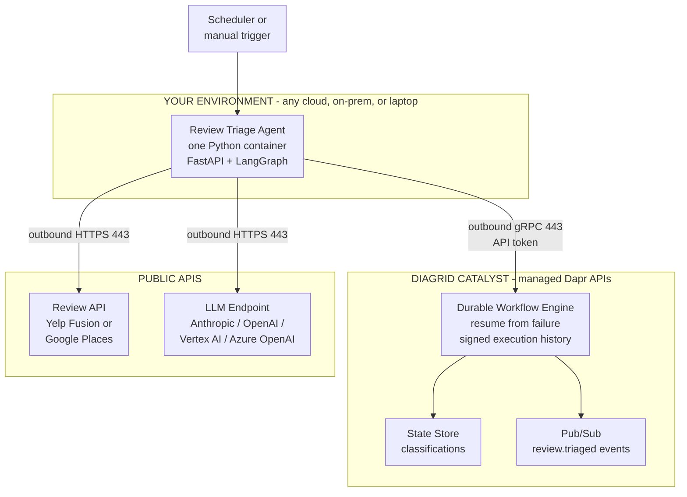
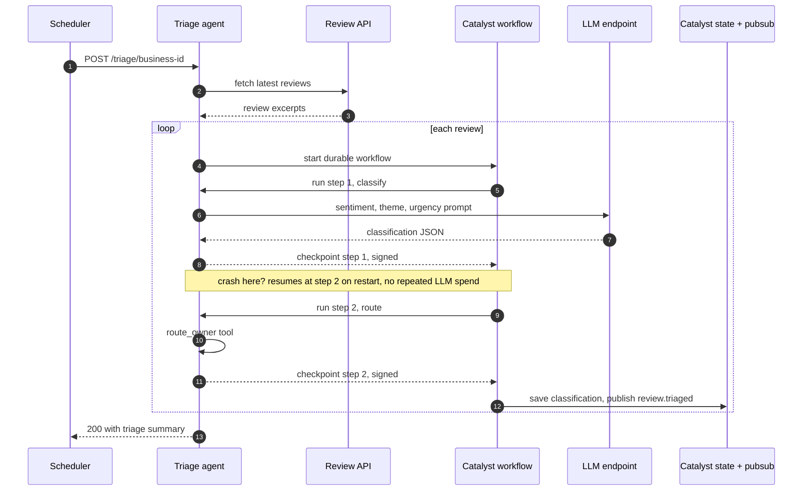

# The Minimum-Approval Enterprise Agent: A Durable Review-Triage Agent on Dapr Catalyst 2.0

> An architect's guide to shipping an AI agent with one container, outbound-only networking, and zero infrastructure tickets. Demo runs on public Yelp/Google review data so any reader can execute it end to end; production swaps in your first-party feedback source without touching the agent. Sources reviewed August 2026; Catalyst 2.0 shipped July 28, 2026.

## The real blocker is not code

Diagrid's quickstarts already teach you to build a durable agent in 15 minutes, including a crash-test demo where the process dies mid-run and resumes exactly where it stopped. Go read their docs for the build.

This post covers what their docs do not: getting an agent **approved and running inside a locked-down enterprise**, and giving readers a demo they can actually run. In a Fortune 500 environment, agent code is the easy part. Every dependency is a firewall request, a security review, and a three-week infrastructure ticket. Redis for state? Ticket. Kafka for events? Ticket plus capacity review. A Kubernetes cluster with a Dapr (Distributed Application Runtime) control plane? A platform-team engagement measured in quarters. Most enterprise agent projects die in that queue.

## The 80/20 rule, applied to approval instead of features

The 20% of agent architecture that gets 80% of the value is a constraint: **every dependency must be an outbound HTTPS call to an allowlisted domain.** No inbound rules. No new stateful infrastructure inside the perimeter. No cluster.

Dapr Catalyst is the managed, serverless version of the Dapr APIs: state, pub/sub, and durable workflows delivered as a cloud service your app reaches over outbound gRPC/HTTPS with an API token. Catalyst 2.0 adds durable execution (a crashed agent resumes from the exact failed step) and verifiable execution (cryptographically signed step history, a chain of custody for compliance). It runs multi-cloud, on-prem, and fully air-gapped.

## The use case: durable review triage

Customer feedback is the one queue every enterprise has and every reader can reach. Public reviews on Yelp or Google are the demo-friendly version of it: no internal ticketing tool, no VPN, no access request. The agent:

1. Fetches the latest reviews for a business over the public API.
2. Classifies each review with an LLM: sentiment, theme, urgency.
3. Routes it with one tool call (theme to owning team).
4. Persists the classification to a state store.
5. Publishes a `review.triaged` event for downstream systems.

Each review runs as a Catalyst durable workflow. A container killed after classification but before publishing resumes at the routing step on restart: no re-billed tokens, no duplicate events, no custom retry code.

**Swap the input, keep the agent.** In production, replace the Yelp fetch with your first-party feedback source: CRM exports, app-store reviews, NPS (Net Promoter Score) comments, dealer surveys. The durable agent, the checkpoints, and the firewall story are unchanged. That is the pattern worth internalizing: the demo proves the architecture on public data, production only re-points the input.

## Architecture



Recall hook: **A-C-L = "Agent Calls out, Latches on"**. One agent container, Catalyst for durability and messaging, public APIs for input and inference. Every arrow crosses the firewall in one direction: outbound.

## Request flow: review to end state



End state, three artifacts per review: the classification persisted in the state store, a `review.triaged` event delivered to subscribers, and a signed execution history for audit. The note between checkpoints is the durability pitch in one line: a crash after the LLM call costs nothing, because the workflow engine, not your container, owns the progress.

## The one-sentence security review

When InfoSec asks what the application needs, the complete answer is:

> "One container making outbound HTTPS/gRPC calls on port 443 to three allowlisted domains, authenticated by API tokens stored in the cloud secret manager. No inbound connectivity, no data stores provisioned inside the perimeter."

| Destination | Port | Purpose |
|---|---|---|
| `*.diagrid.io` (your Catalyst project endpoint) | 443 outbound | State, pub/sub, durable workflow APIs |
| `api.yelp.com` or Google Places endpoint | 443 outbound | Public review data (demo input) |
| Your LLM endpoint (e.g. `api.anthropic.com`) | 443 outbound | Model inference |

Three rows. Compare that to the allowlist, capacity plan, and patching story for self-hosted Redis, Kafka, and a Kubernetes control plane. Data-residency objection from compliance? Catalyst's air-gapped/self-hosted mode is the escalation path: same code, different hosting answer. If your enterprise routes egress through a proxy, the standard `HTTPS_PROXY` / `NO_PROXY` variables apply to the container like any other workload: a deployment flag, not an architecture change.

## The code (minimal on purpose, and in the framework you already use)

Framework choice matters more for adoption than for architecture. LangGraph is what most enterprise teams have already standardized on, so that is what the demo uses. Catalyst's whole 2.0 design supports this: you do not adopt a new framework, you add the `diagrid` package underneath the one you have. Compile your graph as usual, hand it to Diagrid's workflow runner, and the graph's LLM and tool calls become durable workflow activities. Prefer Dapr Agents, CrewAI, Google ADK, or Microsoft Agent Framework? Same architecture, different one-line wrapper; see Diagrid's per-framework docs.

Worth addressing head-on: LangGraph has its own persistence. Its checkpointers save state at superstep boundaries and support resuming from the last successful step. Two gaps remain, and they are exactly the enterprise-shaped ones. First, checkpoints save state but do not detect failures or recover automatically; that logic is still yours to build and operate. Second, a production checkpointer needs a Postgres or Redis you host, which reintroduces the infrastructure tickets this whole post is designed to avoid. Catalyst supplies automatic detection and resume, the signed execution history, and the managed state and pub/sub, all over the same outbound 443.

The skeleton:

```python
# main.py - durable review-triage agent (LangGraph on Catalyst)
import os, json, httpx
from typing import TypedDict
from fastapi import FastAPI
from langgraph.graph import StateGraph, END
from langchain_anthropic import ChatAnthropic
from diagrid.workflow import DaprWorkflowGraphRunner  # verify exact import in Diagrid docs

YELP = "https://api.yelp.com/v3"
ROUTES = {"service": "store-ops@corp.example",
          "product": "merchandising@corp.example",
          "cleanliness": "facilities@corp.example",
          "pricing": "pricing@corp.example"}

class TriageState(TypedDict):
    review: str
    classification: dict
    owner: str

llm = ChatAnthropic(model="claude-sonnet-4-6")

def classify(state: TriageState):
    msg = llm.invoke(
        "Classify this review. Return strict JSON with keys sentiment "
        "(positive|neutral|negative), theme (service|product|cleanliness|"
        f"pricing|other), urgency (act-now|monitor|none), summary.\n{state['review']}")
    return {"classification": json.loads(msg.content)}

def route(state: TriageState):
    theme = state["classification"].get("theme", "other")
    return {"owner": ROUTES.get(theme, "cx-team@corp.example")}

g = StateGraph(TriageState)
g.add_node("classify", classify)
g.add_node("route", route)
g.set_entry_point("classify")
g.add_edge("classify", "route")
g.add_edge("route", END)

# Plain LangGraph so far. This one line adds durable execution via Catalyst:
runner = DaprWorkflowGraphRunner(g.compile())

app = FastAPI()

@app.post("/triage/{business_id}")
async def triage(business_id: str):
    async with httpx.AsyncClient() as c:
        r = await c.get(f"{YELP}/businesses/{business_id}/reviews",
            headers={"Authorization": f"Bearer {os.environ['YELP_API_KEY']}"})
    triaged = [await runner.arun({"review": f"Rating {v['rating']}/5: {v['text']}"})
               for v in r.json().get("reviews", [])]
    return {"business": business_id, "count": len(triaged), "results": triaged}
```

Six dependencies, all pip: `diagrid`, `langgraph`, `langchain-anthropic`, `fastapi`, `uvicorn`, `httpx`. Catalyst connection is pure environment config, identical everywhere: `DAPR_GRPC_ENDPOINT`, `DAPR_API_TOKEN`, plus `YELP_API_KEY` and your LLM key. Dockerfile: `python:3.12-slim`, pip install, uvicorn on port 8080. Pin versions and validate the runner class name and invocation method against Diagrid's LangGraph tutorial before publishing; the surface is weeks old.

## Deploy: the part the vendor docs skip

Diagrid's quickstarts run locally and their production guidance targets Kubernetes. Outbound-only architecture means you do not need a cluster: serverless container platforms scale to zero when no reviews are flowing. And if your platform team mandates GKE (Google Kubernetes Engine), EKS (Elastic Kubernetes Service), or an on-prem cluster, nothing is lost: the app is a plain OCI (Open Container Initiative) image with environment-variable config, so it deploys to any of them unchanged. Serverless is the low-friction default here, not a requirement.

### GCP Cloud Run

```bash
gcloud run deploy review-triage \
  --source . \
  --region us-central1 \
  --no-allow-unauthenticated \
  --set-env-vars "DAPR_GRPC_ENDPOINT=${CATALYST_GRPC}" \
  --set-secrets "DAPR_API_TOKEN=catalyst-token:latest,YELP_API_KEY=yelp-key:latest,LLM_API_KEY=llm-key:latest"
```

Trigger on a schedule with one more command: `gcloud scheduler jobs create http nightly-triage --schedule "0 6 * * *" --uri <service-url>/triage/<business-id> --oidc-service-account-email <sa>`. If org policy forces VPC egress, add a serverless VPC connector and the three allowlist rows to the egress firewall. Nothing else changes.

### Azure Container Apps

```bash
az containerapp up \
  --name review-triage \
  --resource-group rg-agents \
  --location eastus2 \
  --source . \
  --ingress internal --target-port 8080 \
  --env-vars DAPR_GRPC_ENDPOINT=$CATALYST_GRPC \
             DAPR_API_TOKEN=secretref:catalyst-token \
             YELP_API_KEY=secretref:yelp-key \
             LLM_API_KEY=secretref:llm-key
```

Same container image, same environment variables, zero code changes between clouds. Portability is configuration, not refactoring: that is the Dapr promise, and Catalyst removes the last excuse, which was running the control plane yourself.

## What I deliberately left out

The trivial-many 80%, named so the omissions are visibly intentional: multi-agent orchestration, vector memory / RAG (Retrieval-Augmented Generation), review-response drafting, human-in-the-loop approvals, conversation memory, streaming, evaluation harnesses, cost dashboards, prompt versioning, custom OpenTelemetry wiring. Each is an additive follow-up once the first agent is approved and boring in production. Adding them upfront multiplies your security-review surface for zero day-one value.

## Why Catalyst 2.0 specifically

| Without it you must build | Catalyst 2.0 gives you |
|---|---|
| Retry/checkpoint logic per agent step | Durable workflows: resume from exact failure point |
| An audit answer to "what did the agent do" | Cryptographically signed execution history (from Dapr 1.18) |
| Redis + Kafka + their firewall rules | Managed state and pub/sub over outbound 443 |
| A cluster + Dapr control plane | Serverless Dapr APIs; air-gapped self-hosted for sovereign needs |
| A framework bet | Runs under LangGraph, Google ADK, Microsoft Agent Framework, OpenAI Agents SDK, CrewAI, Claude Agent SDK, Dapr Agents |

Closing line: every agent framework made it easy to build agents; the outbound-only pattern on Catalyst makes it possible to get one approved without asking your enterprise for anything but port 443.

## Remaining frictions, and their answers

No vendor writes this section, so it is worth writing. The architecture converts many recurring infrastructure frictions into one upfront vendor friction. Usually a good trade, one review instead of N tickets, but it is a trade, not a free lunch.

| Friction | The honest answer |
|---|---|
| New SaaS vendor: security questionnaire, SOC 2 review, DPA, procurement. Often slower than a firewall ticket. | Start on the free tier under sandbox/POC policy where vendor review is lighter. Air-gapped/self-hosted mode is the fallback when SaaS is a hard no. |
| Data egress: workflow state (review text, classifications, potentially PII in production) transits and rests in Diagrid's cloud. | Pass references and minimal payloads through the workflow, not full content. Self-hosted mode for regulated data. |
| Startup viability: "what if Diagrid disappears?" | Catalyst is built on open-source CNCF Dapr Workflows. The exit path is self-hosting Dapr with the same code, a better answer than most agent-infra startups can give. |
| The `diagrid` package is weeks old: API churn, thin community. | Pin versions, treat the Diagrid docs as source of truth, expect to read source occasionally. |
| Replay semantics are a new mental model: orchestration replays, completed activities return stored results. | Real but small learning curve. Budget one team session on durable-execution debugging before the first incident, not during it. |
| Long-lived API tokens vs workload identity. | Diagrid's stack includes SPIFFE-based workload identity and automatic mTLS; verify how far this extends to your Catalyst connection pattern and rotate tokens via secret manager meanwhile. |

## Scope and caveats

- Review API terms matter. Yelp Fusion returns up to 3 review excerpts per business and restricts long-term storage of Yelp content: persist your classification output, not the review text. Google Places returns up to 5 reviews and requires a billed GCP project. Both are fine for a demo; verify current terms before anything production-shaped, and use first-party feedback data in production anyway.
- Catalyst 2.0 capabilities (durable + verifiable execution, framework list, air-gapped mode, 10x performance claim) are from Diagrid's July 2026 launch materials; performance numbers are vendor-stated.
- Code shown is a skeleton against a fast-moving SDK; the linked Diagrid samples repo is the source of truth for exact APIs.
- Catalyst pricing and free-tier limits change; verify before committing production volume.

## References

- Diagrid, "Agentic Durable Execution" launch blog (July 27, 2026): durable + verifiable execution concept, framework packages, multi-cloud positioning.
- Diagrid Catalyst quickstarts and LangGraph tutorial (docs.diagrid.io/develop/agents/langgraph): durable LangGraph agents on Catalyst, fault tolerance and replay across restarts. Source of truth for exact runner API.
- `diagrid` package on PyPI: extension SDK wrapping LangGraph, CrewAI, Google ADK, Strands, PydanticAI, OpenAI Agents, Claude Agent SDK, LangChain Deep Agents, and Dapr Agents in Dapr Workflows.
- The New Stack, "Diagrid gives failed AI agents a way to resume": mechanics of the graph runner and replay; notes on LangGraph's own persistence layer.
- Yelp Fusion API and Google Places API docs: review endpoints, rate limits, content-usage terms.
- SiliconANGLE and The New Stack coverage (July 28, 2026): supported framework list, Dapr 1.18 signing lineage, deployment modes.

Reviewed: August 2026.
