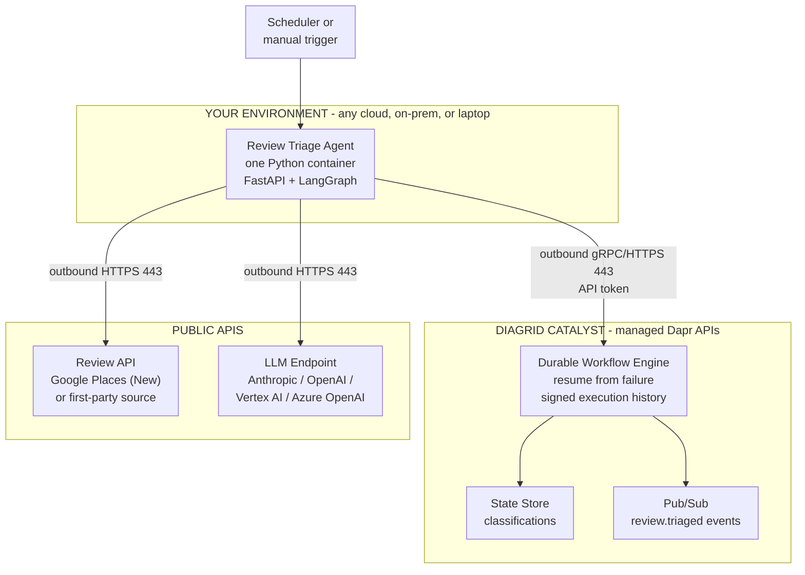
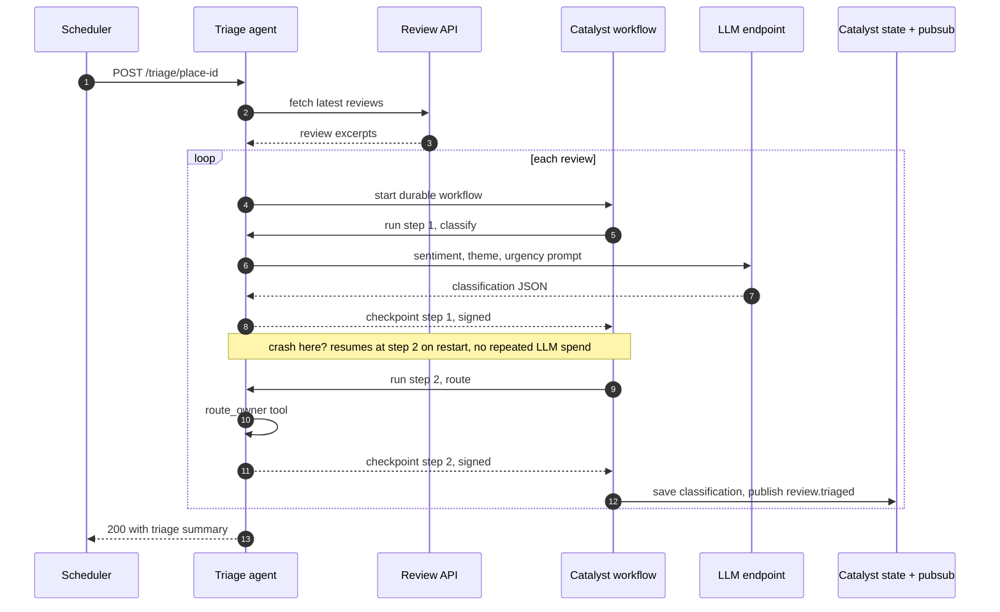

# The Minimum-Approval Enterprise Agent: A Durable Review-Triage Agent on Dapr Catalyst 2.0

> An architect's guide to shipping an AI agent with one container, outbound-only networking, and zero infrastructure tickets. Demo runs on public Google Places review data so any reader with a GCP project can execute it end to end; production swaps in your first-party feedback source without touching the agent. Sources verified August 16, 2026 against Diagrid docs, the `diagridio/python-ai` source, and vendor documentation; Catalyst 2.0 shipped July 28, 2026.

## The real blocker is not code

Diagrid's quickstarts already teach you to build a durable agent in 15 minutes, including a crash-test demo where the process dies mid-run and resumes exactly where it stopped. Go read their docs for the build.

This post covers what their docs do not: getting an agent **approved and running inside a locked-down enterprise**, and giving readers a demo they can actually run. In a Fortune 500 environment, agent code is the easy part. Every dependency is a firewall request, a security review, and a three-week infrastructure ticket. Redis for state? Ticket. Kafka for events? Ticket plus capacity review. A Kubernetes cluster with a Dapr (Distributed Application Runtime) control plane? A platform-team engagement measured in quarters. Most enterprise agent projects die in that queue.

## The 80/20 rule, applied to approval instead of features

The 20% of agent architecture that gets 80% of the value is a constraint: **every dependency must be an outbound HTTPS call to an allowlisted domain.** No inbound rules. No new stateful infrastructure inside the perimeter. No cluster.

Dapr Catalyst is the managed, serverless version of the Dapr APIs: state, pub/sub, service invocation, bindings, and durable workflows delivered as a cloud service your app reaches over outbound HTTPS or gRPC (port 443) with an API token, no sidecar. Catalyst 2.0 adds durable execution (a crashed agent resumes from the exact failed step) and verifiable execution (cryptographically signed step history, a chain of custody for compliance; the signing shipped upstream in open-source Dapr 1.18 on June 10, 2026). It is offered as multi-tenant cloud, dedicated, self-hosted, and fully air-gapped.

## The use case: durable review triage

Customer feedback is the one queue every enterprise has and every reader can reach. Public Google reviews are the demo-friendly version of it: no internal ticketing tool, no VPN, no access request. The demo uses the Google Places API (New), which returns up to five reviews per place and runs on any billed GCP project with a monthly free call allowance; if you are deploying to Cloud Run you already have one. (Yelp Fusion was the original plan; it no longer has a free tier, and its Base plan returns no review text. See the caveats section.) The agent:

1. Fetches the latest reviews for a place over the public API.
2. Classifies each review with an LLM: sentiment, theme, urgency.
3. Routes it with one tool call (theme to owning team).
4. Persists the classification to a state store.
5. Publishes a `review.triaged` event for downstream systems.

Each review runs as a Catalyst durable workflow. A container killed after classification but before publishing resumes at the routing step on restart: no re-billed tokens, no duplicate events, no custom retry code.

**Swap the input, keep the agent.** In production, replace the Places fetch with your first-party feedback source: CRM exports, app-store reviews, NPS (Net Promoter Score) comments, dealer surveys. The durable agent, the checkpoints, and the firewall story are unchanged. That is the pattern worth internalizing: the demo proves the architecture on public data, production only re-points the input.

## Architecture



Recall hook: **A-C-L = "Agent Calls out, Latches on"**. One agent container, Catalyst for durability and messaging, public APIs for input and inference. Every arrow crosses the firewall in one direction: outbound.

## Request flow: review to end state



End state, three artifacts per review: the classification persisted in the state store, a `review.triaged` event delivered to subscribers, and a signed execution history for audit. The note between steps 8 and 9 is the durability pitch in one line: a crash after the LLM call (step 7) costs nothing, because the workflow engine, not your container, owns the progress; on restart the engine replays step 8's stored result and resumes at step 9.

One protocol detail that matters for the firewall story: Dapr workflows are app-initiated. The worker in your container opens a single outbound gRPC stream to Catalyst and pulls work over it, so steps 5, 8, and 9 do not require any inbound port. Publishing (step 12) is also outbound. The moment you *subscribe* to pub/sub, add input bindings, or use service invocation, Catalyst must be able to reach your app and you must allowlist its egress address; that is why this design publishes but never subscribes.

## The one-sentence security review

When InfoSec asks what the application needs, the complete answer is:

> "One container making outbound HTTPS/gRPC calls on port 443 to three allowlisted domains, authenticated by API tokens stored in the cloud secret manager. No inbound connectivity, no data stores provisioned inside the perimeter."

| Destination | Port | Purpose |
|---|---|---|
| `*.diagrid.io` (your Catalyst project's HTTP and gRPC endpoints) | 443 outbound | State, pub/sub, durable workflow APIs |
| `places.googleapis.com` | 443 outbound | Public review data (demo input) |
| Your LLM endpoint (e.g. `api.anthropic.com`) | 443 outbound | Model inference |

Three rows. Compare that to the allowlist, capacity plan, and patching story for self-hosted Redis, Kafka, and a Kubernetes control plane. Data-residency objection from compliance? Catalyst's dedicated, self-hosted, or air-gapped modes are the escalation path: same application code, different hosting answer (with a real cost, covered under remaining frictions). If your enterprise routes egress through a proxy, gRPC honors the standard `HTTPS_PROXY` / `NO_PROXY` variables via HTTP CONNECT, so it is a deployment flag, not an architecture change; test the long-lived workflow stream against your proxy's idle timeout early, since Diagrid publishes no proxy guidance and the Dapr Python SDK does not set gRPC keepalives by default (dapr/python-sdk#813).

## The code (minimal on purpose, and in the framework you already use)

Framework choice matters more for adoption than for architecture. LangGraph is what most enterprise teams have already standardized on, so that is what the demo uses. Catalyst's whole 2.0 design supports this: you do not adopt a new framework, you add the `diagrid` package underneath the one you have. Compile your graph as usual, hand it to Diagrid's workflow runner, and the graph's LLM and tool calls become durable workflow activities. Prefer Dapr Agents, CrewAI, Google ADK, or Microsoft Agent Framework? Same architecture, different one-line wrapper; see Diagrid's per-framework docs.

Worth addressing head-on: LangGraph has its own persistence. Its checkpointers save state at super-step boundaries and let you restart a graph from the last successful step. Two gaps remain, and they are exactly the enterprise-shaped ones. First, checkpoints save state but do not detect failures or recover automatically; that logic is still yours to build and operate. Second, a durable checkpointer means either a database you run (Postgres; SQLite is fine for a laptop, not for a fleet), a managed store such as Cosmos DB, or LangGraph Platform's hosted persistence, which is one more SaaS vendor through procurement. Catalyst supplies automatic detection and resume, the signed execution history, and the managed state and pub/sub, all over the same outbound 443.

The skeleton, verified against `diagrid` 0.4.3 (August 4, 2026) and the `diagridio/python-ai` LangGraph examples (the full runnable version, with a bundled sample-review fallback so it runs with no Google key, is in the companion repo: https://github.com/maheshrajannan/dapr-catalyst-friction-less):

```python
# main.py - durable review-triage agent (LangGraph on Catalyst)
import os, json, httpx
from contextlib import asynccontextmanager
from typing import TypedDict
from fastapi import FastAPI
from langgraph.graph import StateGraph, START, END
from langchain_anthropic import ChatAnthropic
from diagrid.agent.langgraph import DaprWorkflowGraphRunner

PLACES = "https://places.googleapis.com/v1/places"
ROUTES = {"service": "store-ops@corp.example",
          "product": "merchandising@corp.example",
          "cleanliness": "facilities@corp.example",
          "pricing": "pricing@corp.example"}

class TriageState(TypedDict):
    review: str
    classification: dict
    owner: str

llm = ChatAnthropic(model="claude-sonnet-4-6")

def classify(state: TriageState):
    msg = llm.invoke(
        "Classify this review. Return strict JSON with keys sentiment "
        "(positive|neutral|negative), theme (service|product|cleanliness|"
        f"pricing|other), urgency (act-now|monitor|none), summary.\n{state['review']}")
    return {"classification": json.loads(msg.text)}

def route(state: TriageState):
    theme = state["classification"].get("theme", "other")
    return {"owner": ROUTES.get(theme, "cx-team@corp.example")}

g = StateGraph(TriageState)
g.add_node("classify", classify)
g.add_node("route", route)
g.add_edge(START, "classify")
g.add_edge("classify", "route")
g.add_edge("route", END)

compiled = g.compile()   # plain LangGraph so far
runner = None

@asynccontextmanager
async def lifespan(_: FastAPI):
    global runner
    # This is the line that adds durable execution via Catalyst:
    runner = DaprWorkflowGraphRunner(graph=compiled, name="review-triage")
    runner.start()      # opens the single outbound workflow stream to Catalyst
    yield
    runner.shutdown()

app = FastAPI(lifespan=lifespan)

@app.post("/triage/{place_id}")
async def triage(place_id: str):
    async with httpx.AsyncClient() as c:
        r = await c.get(f"{PLACES}/{place_id}",
            headers={"X-Goog-Api-Key": os.environ["GOOGLE_MAPS_API_KEY"],
                     "X-Goog-FieldMask": "reviews"})
    triaged = []
    for v in r.json().get("reviews", []):
        text = f"Rating {v.get('rating')}/5: {v.get('text', {}).get('text', '')}"
        # invoke() is synchronous and blocks until the durable workflow completes;
        # run_async() yields events if you want streaming progress instead.
        triaged.append(runner.invoke({"review": text}, thread_id=f"{place_id}:{v['name']}"))
    return {"place": place_id, "count": len(triaged), "results": triaged}
```

Six dependencies, all pip: `diagrid[langgraph]`, `langgraph`, `langchain-anthropic`, `fastapi`, `uvicorn`, `httpx`. Catalyst connection is pure environment config, identical everywhere: `DAPR_GRPC_ENDPOINT`, `DAPR_HTTP_ENDPOINT`, `DAPR_API_TOKEN` (all three come from the Catalyst console or the `diagrid` CLI), plus `GOOGLE_MAPS_API_KEY` and your LLM key. Dockerfile: `python:3.12-slim`, pip install, uvicorn on port 8080. Pin versions: the `diagrid` package first shipped in March 2026 and is on 0.4.x, so the surface can still move between minor releases. Three things worth knowing about the runner, all confirmed by installing 0.4.3 and reading the source: `name=` is required (the constructor raises without it); there is no `arun`, the choices are the blocking `invoke()` shown here or the async-generator `run_async()`; and the constructor calls Catalyst's metadata API over `DAPR_HTTP_ENDPOINT` to discover optional components, blocking for `DAPR_HEALTH_TIMEOUT` seconds (default 60) if that endpoint is unreachable, which is why the runner is built inside the FastAPI lifespan rather than at import. One more honesty note: "six dependencies" is the direct list; `diagrid[langgraph]` pulls in `dapr-agents` and with it the OpenAI, Anthropic, and Hugging Face clients, about 144 packages in a fresh install, so plan for that in your SBOM scan.

The Places `text` field is a `LocalizedText` object, hence the nested `.get('text')`. Reviews sit in the Enterprise + Atmosphere SKU, so use a tight field mask; and Google's terms prohibit storing review text, which the design already respects by persisting only the classification.

## Deploy: the part the vendor docs skip

Diagrid's quickstarts run locally and their production guidance targets Kubernetes. Outbound-only architecture means you do not need a cluster: serverless container platforms scale to zero when no reviews are flowing. And if your platform team mandates GKE (Google Kubernetes Engine), EKS (Elastic Kubernetes Service), or an on-prem cluster, nothing is lost: the app is a plain OCI (Open Container Initiative) image with environment-variable config, so it deploys to any of them unchanged. Serverless is the low-friction default here, not a requirement.

### GCP Cloud Run

```bash
gcloud run deploy review-triage \
  --source . \
  --region us-central1 \
  --no-allow-unauthenticated \
  --set-env-vars "DAPR_GRPC_ENDPOINT=${CATALYST_GRPC},DAPR_HTTP_ENDPOINT=${CATALYST_HTTP}" \
  --set-secrets "DAPR_API_TOKEN=catalyst-token:latest,GOOGLE_MAPS_API_KEY=maps-key:latest,ANTHROPIC_API_KEY=llm-key:latest"
```

Trigger on a schedule with one more command: `gcloud scheduler jobs create http nightly-triage --location us-central1 --schedule "0 6 * * *" --uri <service-url>/triage/<place-id> --oidc-service-account-email <sa>`. Cloud Run's `internal` ingress explicitly admits Cloud Scheduler, so the service never needs a public endpoint. If org policy forces VPC egress, use Direct VPC egress (Google's current recommended default; the older serverless VPC connector still works and is the better choice if you also need Cloud NAT) and add the three allowlist rows to the egress firewall. Nothing else changes.

### Azure Container Apps

`az containerapp up` has no `--secrets` flag, so secrets are a second step (an open, acknowledged gap in the CLI):

```bash
az containerapp up \
  --name review-triage --resource-group rg-agents --location eastus2 \
  --source . --ingress external --target-port 8080 \
  --env-vars DAPR_GRPC_ENDPOINT=$CATALYST_GRPC DAPR_HTTP_ENDPOINT=$CATALYST_HTTP

az containerapp secret set --name review-triage --resource-group rg-agents \
  --secrets catalyst-token=$DAPR_API_TOKEN maps-key=$GOOGLE_MAPS_API_KEY llm-key=$ANTHROPIC_API_KEY

az containerapp update --name review-triage --resource-group rg-agents \
  --set-env-vars DAPR_API_TOKEN=secretref:catalyst-token \
                 GOOGLE_MAPS_API_KEY=secretref:maps-key \
                 ANTHROPIC_API_KEY=secretref:llm-key
```

Note the asymmetry with Cloud Run: an internal-ingress Container App is reachable only from inside its environment, so an internet-side scheduler cannot call it. Either front it with `--ingress external` plus Easy Auth / Entra ID, or trigger it from a caller inside the environment (a Container Apps job on a cron schedule is the tidiest answer). Same container image, same environment variables, zero code changes between clouds. Portability is configuration, not refactoring: that is the Dapr promise, and Catalyst removes the last excuse, which was running the control plane yourself.

## What I deliberately left out

The trivial-many 80%, named so the omissions are visibly intentional: multi-agent orchestration, vector memory / RAG (Retrieval-Augmented Generation), review-response drafting, human-in-the-loop approvals, conversation memory, streaming, evaluation harnesses, cost dashboards, prompt versioning, custom OpenTelemetry wiring. Each is an additive follow-up once the first agent is approved and boring in production. Adding them upfront multiplies your security-review surface for zero day-one value.

## Why Catalyst 2.0 specifically

| Without it you must build | Catalyst 2.0 gives you |
|---|---|
| Retry/checkpoint logic per agent step | Durable workflows: resume from exact failure point |
| An audit answer to "what did the agent do" | Cryptographically signed execution history (from Dapr 1.18) |
| Redis + Kafka + their firewall rules | Managed state and pub/sub over outbound 443 |
| A cluster + Dapr control plane | Serverless Dapr APIs; air-gapped self-hosted for sovereign needs |
| A framework bet | Runs under LangGraph, LangChain Deep Agents, Google ADK, Microsoft Agent Framework, OpenAI Agents SDK, AWS Strands, CrewAI, PydanticAI, Claude Agent SDK, Spring AI, Dapr Agents |

Closing line: every agent framework made it easy to build agents; the outbound-only pattern on Catalyst makes it possible to get one approved without asking your enterprise for anything but port 443.

## Remaining frictions, and their answers

No vendor writes this section, so it is worth writing. The architecture converts many recurring infrastructure frictions into one upfront vendor friction. Usually a good trade, one review instead of N tickets, but it is a trade, not a free lunch.

| Friction | The honest answer |
|---|---|
| New SaaS vendor: security questionnaire, DPA, procurement. Often slower than a firewall ticket. Diagrid holds SOC 2 Type II (since August 2024); no public ISO 27001, HIPAA, or FedRAMP claim, no public trust center or subprocessor list. | Start on the free tier under sandbox/POC policy where vendor review is lighter. Ask for the SOC 2 report and subprocessor list under NDA up front; if ISO 27001 is a hard gate, this is a no today. |
| **The `diagrid` SDK is not open source.** It is Business Source License 1.1: production use requires a commercial license from Diagrid unless your organization is under 60 people and $15M revenue; it converts to Apache-2.0 on March 1, 2030. PyPI metadata does not surface this. | Your open-source review board will flag it. Confirm in writing whether a Catalyst subscription includes the SDK license. Only Dapr itself (and `dapr/dapr-agents`) is Apache-2.0. |
| Data egress: workflow history stores every step's inputs and outputs (prompts, review text, tool arguments, classifications, potentially PII in production) in Diagrid's store, visible in their console. Encryption at rest and customer-managed keys are not documented. | Pass references and minimal payloads through the workflow, not full content. Self-hosted or dedicated mode for regulated data. |
| Region and private networking are young: the shared cloud runs one public data-plane region (aws-us-west-1) over the public internet; Azure Private Link for dedicated regions shipped August 10, 2026; no AWS PrivateLink or GCP Private Service Connect evidence yet. | If EU residency or private connectivity is mandatory, you are buying Dedicated/BYOC (from $1,199 and $1,599 per month) or self-hosting, not the free tier. |
| "No cluster" is true for your app, not for the fallback. Self-hosted Catalyst needs a dedicated Kubernetes cluster (1.24+), external PostgreSQL with logical replication, a Helm agent with cluster-scoped RBAC, and outbound to six `*.r1.diagrid.io` endpoints that must not be TLS-inspected. Air-gapped install docs are not public. | The self-hosted escape hatch is a platform-team engagement, exactly the thing the outbound-only pattern avoids. Treat it as the year-two option, not the fallback for POC objections. |
| Startup viability: Diagrid is a 2021 Series A company ($24.2M disclosed, no later round found), and the SDK repo has three contributors and single-digit stars. | Catalyst is built on open-source CNCF Dapr Workflows. The exit path is self-hosting Dapr with the same code, a better answer than most agent-infra startups can give; but see the license row, which limits the "same code" part. |
| The `diagrid` package is five months old (first release March 2026, 0.4.3 today) with rapid, sometimes breaking, control-plane releases. | Pin versions, treat the Diagrid docs and `diagridio/python-ai` source as truth, expect to read source occasionally. |
| Replay semantics are a new mental model: orchestration replays, completed activities return stored results. | Real but small learning curve. Budget one team session on durable-execution debugging before the first incident, not during it. |
| App auth is a static bearer token per app (`DAPR_API_TOKEN`) with no documented rotation or workload-identity federation for external apps; console SSO federation is weeks old and SCIM is absent. SPIFFE/mTLS covers Diagrid's internal hops, not your container's connection. | Rotate via secret manager on your own schedule; ask Diagrid for the token-lifetime and OIDC-federation roadmap before production. |

## Scope and caveats

- Review API terms matter. Google Places API (New) returns up to 5 reviews per place, requires a billed GCP project (Google replaced the old $200 monthly credit with per-SKU free call allowances in March 2025; reviews are in the Enterprise + Atmosphere SKU, so the smallest allowance applies), and its terms prohibit storing or caching review text: persist your classification output only. Yelp Fusion, the original plan for this post, now offers a 30-day trial then paid plans from $229/month, and review excerpts require the $299/month Enhanced plan; its terms also cap storage of any Yelp content at 24 hours. Use first-party feedback data in production anyway.
- Catalyst 2.0 capabilities (durable + verifiable execution, framework list, air-gapped mode) are from Diagrid's July 2026 launch materials. The "up to 10x" performance claim is Catalyst versus open-source Dapr, a self-comparison, and vendor-stated.
- Code was checked against `diagrid` 0.4.3 source on August 16, 2026; the `diagridio/python-ai` repository (`examples/langgraph/`) is the source of truth for exact APIs. Note that `diagrid-labs/dapr-agents-catalyst-samples` covers Dapr Agents, not LangGraph.
- Catalyst free tier at time of writing: 3 projects, 10 apps, 3 users, 512 MB per store, 100 requests/s per app, 100k requests/day per project, no SLA. Pricing and limits change; verify before committing production volume.
- Catalyst does not expose the Dapr Actors, Secrets, Configuration, or Distributed Lock APIs, so "same code on self-hosted Dapr" holds for the state, pub/sub, and workflow surface used here, not for every Dapr program.

## References

- Mark Fussell, Diagrid, "Agentic Durable Execution: Durable and Verifiable AI Agent Workflows" (July 27, 2026): https://www.diagrid.io/blog/what-is-agentic-durable-execution
- Business Wire, "Diagrid Catalyst 2.0 Brings Verifiable, Durable Execution to LangGraph, Microsoft Agent Framework, Google ADK and Other Leading AI Frameworks" (July 28, 2026): https://www.businesswire.com/news/home/20260728284090/en/
- Duncan Riley, SiliconANGLE, "Diagrid Catalyst 2.0 adds durable execution to more than 10 agent frameworks" (July 28, 2026): https://siliconangle.com/2026/07/28/diagrid-catalyst-2-0-adds-durable-execution-10-agent-frameworks/
- Frederic Lardinois, The New Stack, "Diagrid gives failed AI agents a way to resume" (July 28, 2026): https://thenewstack.io/diagrid-catalyst-agent-recovery/
- Dapr v1.18.0 release (June 10, 2026) and CNCF, "Introducing Verifiable Execution in Dapr 1.18" (June 11, 2026): https://github.com/dapr/dapr/releases/tag/v1.18.0 ; https://www.cncf.io/blog/2026/06/11/introducing-verifiable-execution-in-dapr-1-18/
- Diagrid docs: LangGraph + Dapr (https://docs.diagrid.io/develop/agents/langgraph/), connecting apps (https://docs.diagrid.io/operate/hosting/connect/), architecture and hosting topologies (https://docs.diagrid.io/concepts/architecture/, https://docs.diagrid.io/operate/hosting/), self-hosted production planning (https://docs.diagrid.io/operate/hosting/enterprise-self-hosted/production-planning/), plans and limits (https://docs.diagrid.io/operate/plans-and-support/), Dapr API compatibility (https://docs.diagrid.io/catalyst/dapr-compatibility/), pricing (https://www.diagrid.io/pricing).
- `diagrid` on PyPI (0.4.3, August 4, 2026): https://pypi.org/project/diagrid/ ; source and LangGraph examples: https://github.com/diagridio/python-ai (LICENSE.md: BSL 1.1); `DaprWorkflowGraphRunner` in `diagrid/agent/langgraph/runner.py`.
- LangGraph persistence and checkpointers: https://docs.langchain.com/oss/python/langgraph/persistence ; https://docs.langchain.com/oss/python/langgraph/checkpointers
- Google Places API (New) Place resource and Review object: https://developers.google.com/maps/documentation/places/web-service/reference/rest/v1/places ; Maps Platform terms (no scraping/caching): https://cloud.google.com/maps-platform/terms/ ; pricing: https://mapsplatform.google.com/pricing/
- Yelp Fusion reviews endpoint, pricing, and API terms: https://docs.developer.yelp.com/reference/v3_business_reviews ; https://business.yelp.com/data/resources/pricing/ ; https://terms.yelp.com/developers/api_terms/20250113_en_us/
- Cloud Run: deploy reference (https://docs.cloud.google.com/sdk/gcloud/reference/run/deploy), ingress (https://docs.cloud.google.com/run/docs/securing/ingress), VPC egress (https://docs.cloud.google.com/run/docs/configuring/connecting-vpc); Azure Container Apps: `az containerapp up` secrets gap (https://github.com/microsoft/azure-container-apps/issues/340), ingress overview (https://learn.microsoft.com/en-us/azure/container-apps/ingress-overview).
- Anthropic model IDs (dateless format from 4.6 onward; `claude-sonnet-4-6` current, `claude-sonnet-5` newest): https://platform.claude.com/docs/en/about-claude/models/overview
- Diagrid company: TechCrunch, "With $24.2M in funding, Diagrid launches..." (October 12, 2022): https://techcrunch.com/2022/10/12/with-24-2m-in-funding-diagrid-launches-its-fully-managed-dapr-service-for-kubernetes/ ; SOC 2 Type II: https://www.diagrid.io/blog/diagrid-achieves-soc-2-type-ii-compliance

Reviewed and fact-checked: August 16, 2026.
